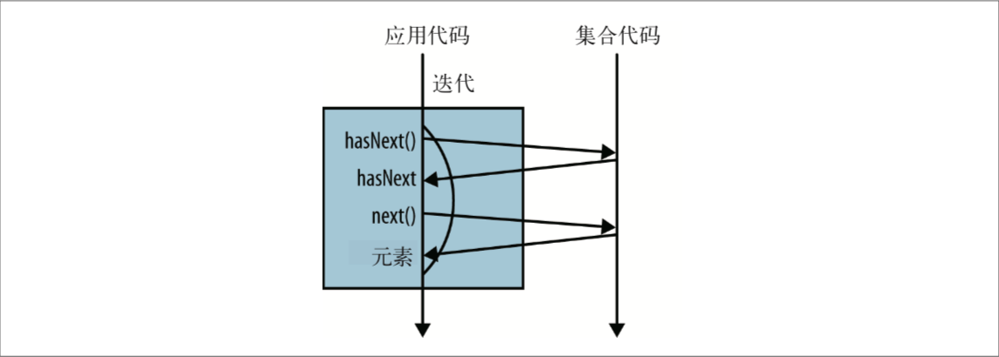
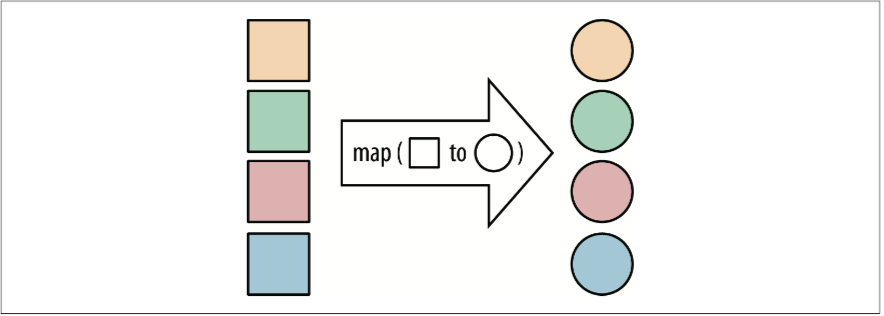

# Java 8函数式数据处理

# 1 流

## 1.1 流是什么

**流**是Java 8中新引入的概念，它允许你以声明式方式处理数据集合（通过查询语句来表达，而不是临时编写一个实现）。

举个例子，筛选出价格大于¥50的菜品，并对这些菜品进行排序，最后返回菜品名称的集合，在Java 8之前：

```Java
//第一步，筛选
List<Dish> tempList = new ArrayList<>(dishes.size());
for (Dish dish : dishes) {
	if (dish.getPriceCent() > 5000) {
		tempList.add(dish);
	}
}
//第二步，排序
Collections.sort(tempList, new Comparator<Dish>() {
	public int compare(Dish d1, Dish d2) {
		return d1.getPriceCent() - d2.getPriceCent();
	}
});
//第三步，返回名称集合
List<String> result = new ArrayList<>(tempList.size())
for (Dish dish : tempList) {
	result.add(dish.getName());
}
```
在Java 8中，引入了流的概念之后，结合Lambda表达式：

```Java
List<String> result = dishes.stream()
							.filter(dish -> dish.getPriceCent() > 5000)
							.sorted(comparing(Dish::getPriceCent))
							.map(Dish::getName)
							.collect(toList());
```

流式方法的好处：

- 代码是以声明性方式写的，说明想要完成什么，而不是如何实现一个操作；
- 把几个基本操作链接起来，用以表达复杂的数据操作流水线，使代码清晰可读。

使用Java 8的Stream API可以写出这样的代码：

- 声明性——更简洁 ，更易读
- 可复合——更灵活
- 可并行——性能更好

## 1.2 流简介

### 1.2.1 概念和术语

Java 8中的集合支持一个新的stream方法，它会返回一个流，当然也有很多其他方法，比如利用数值范围或者I/O资源也可以生成流元素。

定义：**从支持数据处理操作的源生成得元素序列。**

关键概念：

|术语 			|说明	|
|----			|----		|
|元素序列		|类似集合，流提供一个接口，可以访问特定元素类型的一组有序值。集合讲的是数据，流讲的是计算。|
|源				|流会使用一个提供数据的源，比如集合、数组或者是I/O. 从有序集合生成流时会保留原有的序列。|
|数据处理操作	|流的数据处理功能类似于数据库的操作，以及函数式编程语言中的常用操作，如filter、map、reduce、find、match、sort等。流操作可以顺序执行，也可以并行执行。|
|流水线			|很多的流操作本身会返回一个流，这样多个操作就可以链接起来，形成一个流水线。|
|内部迭代		|和使用迭代器进行显示迭代的集合不同，流的迭代操作是在背后进行的。|

### 1.2.2 外部迭代与内部迭代

使用Collection接口需要用户自己去做迭代，称为**外部迭代**。

使用Stream进行的迭代是**内部迭代**，Stream已经帮你把迭代做了，你只需要告诉它你需要干什么就可以了。

外部迭代：


内部迭代：


## 1.3 常见的流操作

### 1.3.1 collect(toList)

collect(toList)方法由Stream里的值生成一个列表。of方法可以生成一个流对象。

```Java
List<String> list = Stream.of("a", "b", "c").collect(Collectors.toList());
```

### 1.3.2 map

map操作可以将一个流中的一种值转换成另一种类型的值，生成一个新的流。比如，将一个集合中的字符串全部转换成大写。

```Java
List<String> upperCaseList = 
	Stream.of("talk", "is", "cheap", ",", "show", "me", "the", "code")
		.map(string -> string.toUpperCase())
		.collect(toList());
```

 

map操作传入的Lambda表达式必须和Function接口的签名一致。

### 1.3.3 filter

filter用来遍历数据并选出符合特定条件的元素。比如筛选出一个字符串集合中仅含数字的字符串。

```Java
List<String> digtalList = Stream.of("a1c", "123", "1q2qw", "0.5")
	.filter(string -> string.isDigtalOnly())
	.collect(toList());
```


同样，filter操作传入的Lambda表达式必须和Predict接口的签名一致。

### 1.3.4 min和max

求最小值和求最大值。比如求菜品集合中价格最低和最高的菜。

```Java
List<Dish> dishes = ...
Dish max = dishes.stream()
	.max(Comparator.comparing(dish -> dish.getPrice))
	.get();
	
Dish min = dishes.stream()
	.mix(Comparator.comparing(dish -> dish.getPrice))
	.get();
```

### 1.3.5 reduce

reduce操作可以从一组值中生成一个值，实际上max和min也是reduce操作，因为太常用，所以被纳入了标准库中。举例，求和：

```Java
int sum = Stream.of(1, 2, 3, 4)
	.reduce(0, (acc, element) -> acc + element);
```


## 1.4 流与集合

### 1.4.1 流与集合概念的差异

从前面的例子中可以看到，通过Stream.of(...)方法可以得到一个流对象，看起来数据源似乎是保存在了流对象中，这和集合中保存一组数据很类似。但是，最终从流中获取一个集合，还需要调用collect(toList())方法，由此可见，流并不是集合。

流与集合到底有什么差异呢？举一个形象的例子，存在DVD中的电影，这就是一个集合，因为它包含了电影的全部数据，而网上在线播放的视频则是一个视频流，它只加载你当前观看的这几帧，不用等到所有的数据都加载完了才能看。

所以简单来讲，集合与流之间的差异就在于何时进行计算。集合是内存中的一种数据结构，它包含了数据源的所有值，集合的每个元素都需要先计算出来然后再加入到集合中。而流的元素则是按需计算，仅仅在用户需要的时候才会提取值，这是一种生产者—消费者的关系，只有消费者要求的时候才会去计算值。

### 1.4.2 流只能遍历一个

和迭代器类似，流只能遍历一次，遍历完成之后，这个流就已经被消费掉了。如果想再次遍历，需从数据源重新获取一个流（如果数据源是可重复的比如集合，这会很容易，但如果像I/O这种的话，就会很麻烦）。

重复消费一个流会跑出IllegalArgumentException，表示流已经被操作，或者关闭。

```
List<String> firms = Arrays.asList("Google", "AT&T", "Amazon", "Facebook", "Oracle", "MicroSoft");
Stream<String> stream = Stream.of(firms);
stream.forEach(System.out::println);
stream.forEach(System.out::println);
```


（未完待续...）


