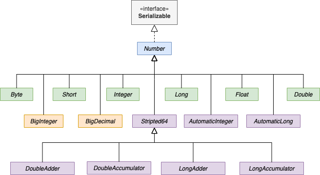
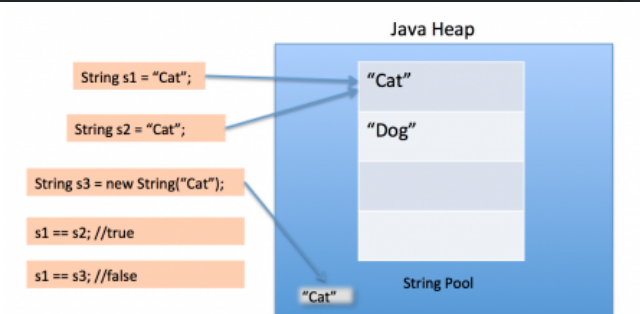

# 数字和字符串

## 数字

数字类的继承关系



大体上分为3类

**包装类型**

Byte、Short、Integer、Long、FLoat、Double这6个类对应相应的基本类型，和基本类型可以互相拆箱和装箱

**大数**

BigInteger和BigDecimal是java.math包中的类，其作用是为了精确表示浮点数，以及整数的大数计算

**原子操作类**

AutomaticInteger、AutomaticLong、Scripted64这几个类是java.util.concurrent.atomic包中的类，用来处理原子性操作的。

基本类型的自增和自减操作，实际上是可以拆解成n=n+1(或n=n-1)，不具备原子性，因此增加了原子类来做原子性的计算。

除了图中列出的几个，还有AutomaticBoolean等原子类，只是不继承Number

## 字符串

### String*

Java中String是一个final类型的类，官网文档上说它算是基本类型，但是它是一个类。

早期的jdk版本中，String底层是通过char[]来保存字符的，从java 10开始，底层已经替换成byte[]了。

创建字符串的方式有2种：

```Java
String s1 = "abc";
String s2 = new String("abs");
```

**常量池**

Java中的字符串常量池(String Pool)是存储在堆中的中的字符串池。



如果直接通过""创建的字符串时，会先从常量池中找，如果存在，则返回返回其引用，否则会先在常量池中创建对象。通过new String()的方式创建的字符串则会在堆中创建新的字符串对象。调用intern()方法可以将字符串放入到常量池中。

使用常量池的好处是复用了对象，减少了对象的内存占用。

**字符串的操作**

- 拼接
  
:  1、通过concat方法
   2、通过+，如果拼接的字符串都是已知的常量，编译器会优化成常量，否则会优化成StringBuilder拼接

  两种方法都会创建新的字符串对象

- 分割 -- slipt
- 子串 -- subString

### StringBuilder


String、StringBuilder、StringBuffer都实现了CharSequence，其中StringBuilder和StringBuffer都是AbstractStringBuilder的子类。

AbstractStringBulder中提供了很多拼接的append和inser方法，也有delte、replace、substring等方法，AbstractStringBuilder只有toString()方法是抽象的。

StringBuilder继承了AbstractStringBulder，基本都是调用的super()方法来完成字符串的拼接。

toString的实现：

```Java
    @Override
    public String toString() {
        // Create a copy, don't share the array
        return isLatin1() ? StringLatin1.newString(value, 0, count)
                          : StringUTF16.newString(value, 0, count);
    }
```

### StringBuffer

StirngBuffer的实现方式和StringBuilder几乎一模一样，只不过其所有对字符串操作的方法都有synchronized关键字，如append、replace、substring、insert、toString等。

因为使用了synchronized关键字，StringBuffer拼接字符串是线程安全的，但同时也会相对慢一些。

另一个不同是StringBuff中toString()方法会用到一个stringCache，toString()时，先根据字符的编码方式生成一个StringCache，再根据stringCache创建一个新的字符串。

```Java
    @Override
    public synchronized String toString() {
        if (toStringCache == null) {
            return toStringCache =
                    isLatin1() ? StringLatin1.newString(value, 0, count)
                               : StringUTF16.newString(value, 0, count);
        }
        return new String(toStringCache);
    }
```

StringBuffer和StringBuilder的toString方法都会生成新的字符串。

*参考*

1. [Oracle-数字与字符串](https://docs.oracle.com/javase/tutorial/java/data/index.html)
2. [The Java® Language Specification 3.10.5. String Literals](https://docs.oracle.com/javase/specs/jls/se8/html/jls-3.html#jls-3.10.5)
