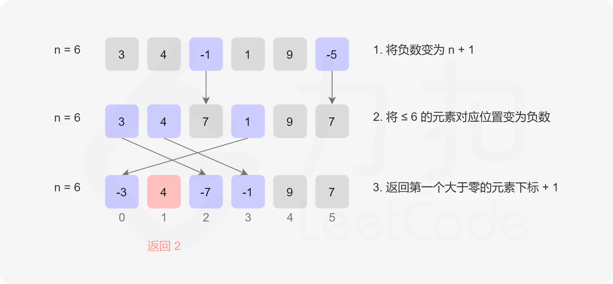

# 数组/字符串


## [27.移除数组中指定元素](https://leetcode.cn/problems/remove-element/description/)

难度：⭐️

给你一个数组 `nums` 和一个值 `val`，你需要 原地 移除所有数值等于 `val` 的元素。元素的顺序可能发生改变。然后返回 `nums` 中与 `val` 不同的元素的数量。

**解法一** 暴力解法

[不推荐] 直接2层循环，遇到重复的元素，把后面的元素都覆盖到前面。

<details>
  <summary>暴力遍历</summary>
  ```java
    public int removeElement(int[] nums, int val) {
        int k = 0;
        for (int i = 0; i < nums.length - k;) {
            if (nums[i] != val) {
                i++;
                continue;
            }
            k++;
            for (int j = i; j < nums.length - 1; j++) {
                nums[j] = nums[j + 1];
            }
        }
        return nums.length - k;
    }
  ```
</details>

**解法二** 快慢指针

相等元素移动快指针，不同元素直接赋值。

<details>
  <summary>快慢指针</summary>
  ```java
    public int removeElement(int[] nums, int val) {
        int slow = 0;
        int fast = 0;
        int k = 0;
        while (fast < nums.length) {
            if (nums[fast] == val) {
                fast++;
            } else {
                nums[slow] = nums[fast];
                slow++;
                fast++;
                k++;
            }
        }
        return k;
    }
  ```
</details>

**解法三** 双指针

没有要求有序，可以使用左右指针，元素相等时，将右指针上元素赋值给当前位置，右指针左移，直到两个指针相遇。

<details>
  <summary>左右双指针</summary>
  ```java
    public int removeElement(int[] nums, int val) {
        int left = 0;
        int right = nums.length;
        int k = 0;
        while (left < right) {
            if (nums[left] == val) {
                nums[left] = nums[right - 1];
                right--;
            } else {
                k++;
                left++;
            }
        }
        return k;
    }
  ```
</details>


## [41.缺失的第一个正数](https://leetcode.cn/problems/first-missing-positive)

难度：难度：⭐️⭐️⭐️⭐️

给你一个未排序的整数数组 `nums` ，请你找出其中没有出现的最小的正整数。

请你实现时间复杂度为 `O(n)` 并且只使用常数级别额外空间的解决方案。

**解法一** 哈希表

空间复杂度为O(n)，用哈希表将数组中的元素存起来。for循环，当哈希表中不存在该元素时，下标的n+1位置就是缺失的第一个正数，如果循环完了每个元素都在哈希表中，结果就是数组的长度加1.

<details>
  <summary>哈希表(空间复杂度不满足题目要求)</summary>

  ```java
    public int firstMissingPositive(int[] nums) {
        Set<Integer> set = new HashSet<>();
        for (int n : nums) {
            set.add(n);
        }
        for (int i = 0; i < nums.length; i++) {
            if (!set.contains(i + 1)) {
                return i + 1;
            }
        }
        return nums.length + 1;
    }
  ```
</details>

**解法二** 原地哈希



<details>
  <summary>原地哈希</summary>

  ```java
  public int firstMissingPositive(int[] nums) {
        int n = nums.length;
        // 把所有的负数都变成正数
        for (int i = 0; i < n; i++) {
            if (nums[i] <= 0) {
                nums[i] = 1 + n;
            }
        }
        // 对于小于n的数，将nums[n]设置成负数，那么没有设置的数字，就是缺失的正数
        // 相当于变相建立了一个哈希表 <num, index>
        for (int i = 0; i < n; i++) {
            int num = Math.abs(nums[i]);
            if (num <= n) {
                nums[num - 1] = -Math.abs(nums[num - 1]);
            }
        }
        // 遍历数组，找到第一个正数，下标即为缺失的正数
        for (int i = 0; i < n; i++) {
            if (nums[i] > 0) {
                return i + 1;
            }
        }
        return n + 1;
    }
  ```
</details>

## [76. 最小覆盖子串](https://leetcode.cn/problems/minimum-window-substring)

难度：⭐️⭐️⭐️⭐️

给你一个字符串 `s` 、一个字符串 `t` 。返回 `s` 中涵盖 `t` 所有字符的最小子串。如果 `s` 中不存在涵盖 `t` 所有字符的子串，则返回空字符串 `""` 。

**解法一** 滑动窗口

使用哈希表保存子串中每个对应字符出现的次数，滑动窗口，记录每个窗口中子串是否满足条件，满足条件移动窗口左值，否则移动窗口右值。

<details>
  <summary>滑动窗口</summary>

  ```java
    public String minWindow(String s, String t) {
        if (s.length() < t.length()) {
            return "";
        }
        Map<Character, Integer> dict = new HashMap<>();
        Map<Character, Integer> subDict = new HashMap<>();
        for (int i = 0; i < t.length(); i++) {
            char c = t.charAt(i);
            dict.put(c, dict.getOrDefault(c, 0) + 1);
        }
        int left = 0;
        int right = 0;
        int rl = 0;
        int rr = Integer.MAX_VALUE;
        while (right < s.length()) {
            char rc = s.charAt(right);
            subDict.put(rc, subDict.getOrDefault(rc, 0) + 1);
            while (contains(dict, subDict)) {
                char lc = s.charAt(left);
                subDict.put(lc, subDict.getOrDefault(lc, 1) - 1);
                if (rr - rl > right - left) {
                    rl = left;
                    rr = right;
                }
                left++;
            }
            right++;
        }
        if (rr - rl > s.length()) {
            return "";
        } else {
            return s.substring(rl, rr + 1);
        }
    }

    private boolean contains(Map<Character, Integer> dict, Map<Character, Integer> subDict) {
        for (Map.Entry<Character, Integer> entry : dict.entrySet()) {
            Character c = entry.getKey();
            int count = entry.getValue();
            int subCount = subDict.getOrDefault(c, 0);
            if (count > subCount) {
                return false;
            }
        }
        return true;
    }
  ```
</details>


## [88.合并2个有序数组](https://leetcode.cn/problems/merge-sorted-array/description)

难度：难度：⭐️

给你两个按 非递减顺序 排列的整数数组 `nums1` 和 `nums2`，另有两个整数 `m` 和 `n` ，分别表示 `nums1` 和 `nums2` 中的元素数目。

请你 合并 `nums2` 到 `nums1` 中，使合并后的数组同样按 非递减顺序 排列。

**注意**：最终，合并后数组不应由函数返回，而是存储在数组 `nums1` 中。为了应对这种情况，`nums1` 的初始长度为 `m + n`，其中前 `m` 个元素表示应合并的元素，后 `n` 个元素为 `0` `，应忽略。nums2` 的长度为 `n` 。

**解法一**  排序法 

第一次遍历把元素都移到num1的末尾，直接调用Arrays.sort(nums)排序。

<details>
  <summary>排序法</summary>
  ```java
    public void merge(int[] nums1, int m, int[] nums2, int n) {
        for (int i = 0; i < n; i++) {
            nums1[m + i] = nums2[i];
        }
        Arrays.sort(nums1);
    }
  ```
</details>

**解法二**  双指针

双指针，倒序遍历，每次将较大的放入数组中

<details>
  <summary>倒序双指针</summary>

  ```java
    public void merge(int[] nums1, int m, int[] nums2, int n) {
        for (int i = m + n - 1; i >= 0; i--) {
            if (n == 0) {
                break;
            }
            if (m > 0 && nums1[m - 1] > nums2[n - 1]) {
                nums1[i] = nums1[m - 1];
                m--;
            } else {
                nums1[i] = nums2[n - 1];
                n--;
            }
        }
    }
  ```
</details>


## [189. 轮转数组](https://leetcode.cn/problems/rotate-array)

难度：⭐️⭐️⭐️

给定一个整数数组 `nums`，将数组中的元素向右轮转 `k` 个位置，其中 `k` 是非负数。

**解法一** 循环

下标每次走k步，直到走完n步。注意走到重复的位置时，往后多走一步，防止西循环。

<details>
  <summary>循环</summary>

  ```java
    public void rotate(int[] nums, int k) {
        int n = nums.length;
        k = k % n;
        if (k == 0) {
            return;
        }
        int count = 0;
        int v = nums[0];
        int p = 0;
        int start = 0;
        while (count < n) {
            int next = (p + k) % n;
            int nextValue = nums[next];
            nums[next] = v;
            v = nextValue;
            p = next;
            if (p == start) {
                start++;
                p++;
                v = nums[p];
            }
            count++;
        }
    }
  ```
</details>

**解法二** 额外空间

先申请额外的空间，把后面的元素保存上。

## [238. 除自身以外数组的乘积](https://leetcode.cn/problems/product-of-array-except-self)

难度：⭐️⭐️⭐️

**解法一** 左右数组

额外创建2个数组，分别从左和右保存乘积。

<details>
  <summary>左右数组</summary>

  ```java
  public int[] productExceptSelf(int[] nums) {
        int n = nums.length;
        int[] left = new int[n];
        int[] right = new int[n];
        left[0] = nums[0];
        right[n - 1] = nums[n - 1];
        for (int i = 1; i < n; i++) {
            left[i] = nums[i] * left[i - 1];
            right[n - i - 1] = nums[n - i - 1] * right[n - i];
        }
        int[] result = new int[n];
        for (int i = 0; i < n; i++) {
            int l = 1;
            int r = 1;
            if (i > 0) {
                l = left[i - 1];
            }
            if (i < n - 1) {
                r = right[i + 1];
            }
            result[i] = l * r;
        }
        return result;
    }
  ```
</details>

**解法二** 优化的左右乘积列表

基于解法一，直接利用结果数组，第一次遍历从左往右，第i个位置保存其左边元素的乘积，第二次遍历从右往左，但是将右边元素的乘积用一个数字记录起来。

<details>
  <summary>优化的左右乘积列表</summary>

  ```java
    public int[] productExceptSelf(int[] nums) {
        int[] result = new int[nums.length];
        result[0] = 1;
        for (int i = 1; i < nums.length; i++) {
            result[i] = result[i - 1] * nums[i - 1];
        }
        // 1 2 3 24
        int r = 1;
        for (int i = nums.length - 1; i >= 0; i--) {
            result[i] = r * result[i];
            r *= nums[i];
        }
        return result;
    }
  ```
</details>

## [560. 和为 K 的子数组](https://leetcode.cn/problems/subarray-sum-equals-k)

难度：⭐️⭐️

给你一个整数数组 nums 和一个整数 k ，请你统计并返回 该数组中和为 k 的子数组的个数 。

子数组是数组中元素的连续非空序列。

**解法一** 穷举

2层遍历，穷举所有的组合。

<details>
  <summary>2层遍历穷举法</summary>
  ```Java
  public int subarraySum(int[] nums, int k) {
        int ret = 0;
        for (int i = 0; i < nums.length; i++) {
            int sum = 0;
            for (int j = i; j < nums.length; j++) {
                sum += nums[j];
                if (sum == k) {
                    ret++;
                }
            }
        }
        return ret;
    }
  ```

</details>


**解法二** 哈希表  

使用哈希表，key为前缀和，value为该前缀和的数量。遍历时，同时记录前缀和为某个值的数量。

<details>
  <summary>哈希表记录前缀和</summary>
  ```Java
  public int subarraySum(int[] nums, int k) {
        // <sum, count>
        Map<Integer, Integer> map = new HashMap<>();
        map.put(0, 1);
        int count = 0;
        int sum = 0;
        for (int i = 0; i < nums.length; i++) {
            sum += nums[i];
            if (map.containsKey(sum - k)) {
                count += map.get(sum - k);
            }
            map.put(sum, map.getOrDefault(sum, 0) + 1);
        }
        return count;
    }
  ```

</details>