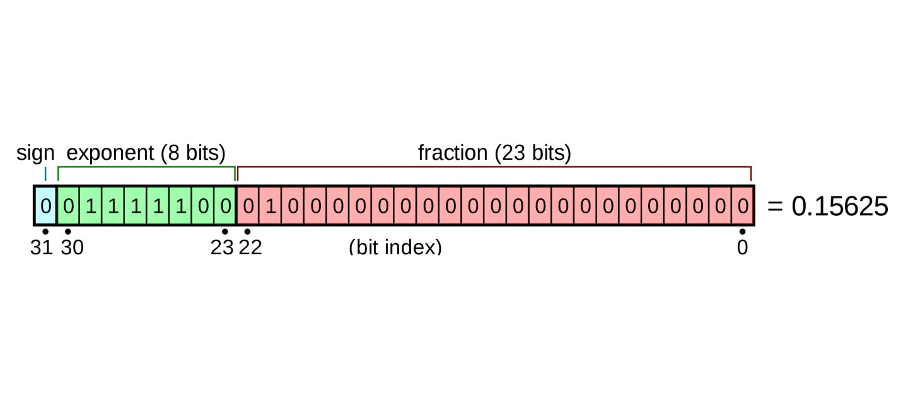

# 基本数据类型

Java是一种静态编程语言，所有的变量都必须显式的声明类型。Java中基础的数据类型一共有8种，分别是boolean、char、byte、short、int、long、float和double.

## 基本特性

| 类型     | 长度(字节) | 取值范围                         | 默认值   |
| :--     | :-        | :-                              | :-      |
| boolean | 1         | true\false                      | false   |
| char    | 2         | '\u0000'~'\uffff'               | '\u0000'|
| byte    | 1         | -128~127                        | 0       |
| short   | 2         | -32768~32767                    | 0       |
| int     | 4         | -2<sup>31</sup>~2<sup>31-1</sup>| 0       |
| long    | 8         | -2<sup>63</sup>~2<sup>63-1</sup>| 0       |
| float   | 8         | -3.4E+38 ~ 3.4E+38             | 0.0f    |
| double  | 8         | -1.7E-308～1.7E+308             | 0.0d    |

**布尔类型**

boolean类型只有true和false两个值。

**字符类型**

char类型由于是2个字节，可以表示到'\uffff'的字符，更长的字符就需要用String类表示了，Oracle官网上把String也认为是基本数据类型的一种了。

**数字类型**

几种数字类型中，4种数字类型表示的数都是精确的，但是根据其所占的变量类型，表示的整数范围是有限的，如果想要表示更大的数字，需要使用BigInteger类来表示。

float和double遵循IEEE/754的标准来表示数字，但是他们表示的数字都是不精确的，原因是float和double类型变量在存储时使用二进制的科学计数法来表示，表示成±1.f*2<sup>e</sup>，小数部分的位数有限（float小数部分23位，指数部分8位，double小数部分53位，指数部分11位），对于小数除不尽的情况，只能丢弃。



如果想要精确表示浮点数，应该用BigDecimal类。

对于这8种基本类型，Java中还有对应的8个包装类型。

## 语法与语义

### 变量声明

**char**

声明char类型变量时，变量需要用单引号括起来，如`char c = 'J'`，引号中可以是unicode编码在0~0xffff中的任意字符，超过范围则会编译报错，因此，类似`char c = '我'`是没问题的。

声明char类型变量时，也可以直接将数字类型赋值给变量，此时字符表示的是ASCII码对应的字符，如`char c = 65`和`char c = 'A'`是一样的，但是如果数字的范围超过了2个字节，则也会编译失败。

类型强制转换时，整数类型也可以强转成char，同样也是ASCII码对应的字符。

**byte、short、int和long**

byte和short类型变量声明和int一样，不需要显示指定数字的类型，但是值必须在可表示的范围内，费泽会编译出错，如byte只能在-128~127之间。

long类型声明变量时，需要在数字末尾加上l或L，如`long num = 11L`。由于l和1在一些字体上，显示的非常相像，一般用L。

long类型声明时，可以不带后缀，但实际上这种写法是将int类型强转成long，由于long类型所占字节更长，强转时高位补0，实际上不会有损失，但是一般建议long类型还是要加后缀显式声明。


**float和double**

float的变量声明需要显式的加f或F后缀，double需要加d或者D，不加则默认是用doble来表示的，如`float f = 1f`、`double d = 2d`。声明float变量时，强烈建议加上后缀，不加是会将一个double类型的数字强转成float，编译时会有警告，但不会出错。

float和double还可以用科学计数法的形式声明，如`double f = 1.1e3`，表示的是1.1*2<sup>3</sup>，即8.8。

浮点数如果整数部分为0，声明时可不写整数部分，如`float f = .34f`；小数部分如果是0，小数也可以不写，如`float g = 1.f`。


### 浮点数的比较

浮点数在计算过程中也会丢失精度，如下面的代码，0.1累加11次和0.1直接乘11，产生的浮点数就不一样。

```Java
    public void float() {
        double f1 = .0;
        for (int i = 0; i < 11; i++) {
            f1 += .1;
        }

        double f2 = .1 * 11;

        System.out.println("f1 = " + f1); // f1 = 1.0999999999999999
        System.out.println("f2 = " + f2); // f2 = 1.1

    }
```

由于浮点数表示的不精确性，一般比较浮点数推荐两种方式

**计算差值和阈值对比**

```Java
public boolean equals(double f1, double f2) {
    final double THRESHOLD = .0001;
    return Math.abs(f1 - f2) < THRESHOLD;
}
```

**使用BigDecimal**

使用BigDecimal来比较时，必须使用compareTo对比，不能用equals，因为equals会先比较精度，再比较值。

```Java
public void equals() {
    BigDecimal a = new BigDecimal("2.00");
	BigDecimal b = new BigDecimal("2.0");

	System.out.println(a.equals(b)); 			// false

	System.out.println(a.compareTo(b) == 0); 	// true
}
```

### 进制表示

对于byte、short、int和long类型，可以用二进制、八进制、十进制、十六进制来声明变量。

**二进制**

0b前缀来表示变量时二进制的，二进制中只能有0和1，其他数字会编译报错报错。

**八进制**

前缀0表示数字是八进制的，如`int i = 010`表示的是十进制的8，同样8进制中只能有数字0~7，8进制一般较少用，声明八进制的数字，编译器可能给有警告，要求使用10进制表示。

**十进制**

十进制是默认的表示方法，什么前缀都不需要加。

**十六进制**

通过前缀0x表示，数字中可以有0~9，A~F，表示0~15的值，不区分大小写。

### 下划线分割符

当数字太长时，可以通过下划线来分割数字，分割符只能放在数字的中间，不能放在首尾，浮点数的小数部分也可以用分隔符，也是只能放在小数部分的数字中间，例如:

```Java
int a = 8_000;
byte b = 0b1111_1111
long num = 0xFFFF_0AEE;
float f = 1_2_3.987_654f;
```

*参考*

1. [The Java™ Tutorials Variables](https://docs.oracle.com/javase/tutorial/java/nutsandbolts/variables.html)
2. [Correct way to compare floats or doubles in Java](https://howtodoinjava.com/java-examples/correctly-compare-float-double/#threshold-based)