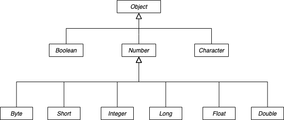

# 引用数据类型

Java中除了8种基本的数据类型，其他所有的数据类型都是引用数据类型。

## 基本数据类型和引用数据类型的区别

**存储**

基本类型的变量存储的是值，引用数据类型的变量中则存的是对象的引用，类似于C中的指针。

对于方法中的使用，基本类型一般来说是存储在栈中，而引用类型则存储在堆空间中。

**传值方式**

基本类型变量在传递时传递的是值，而引用类型传递的是对象的引用。因此对于Java中的方法的参数，如果参数是基本类型变量，在方法栈中会新建一个变量，并将参数中的值赋值给这个变量，如果参数是引用类型，则在方法中使用的还是原本的对象，修改对象的属性，修改的也是原对象的属性。

## 类型比较

Java中比较有==和equals两种。

对于包装类型，==是用来比较对象的内存地址的，当两个引用类型的变量指向内存中同一个区域时，==相等，两个对象相等。基本类型==是比较值相等的。

equals是Object的一个方法，比较的是对象的值，如果对象没有重写equals，默认实现用的也是==。基本类型由于不继承Object对象，一般不用equals比较。

## 常见的引用数据类型

### 基本类型的包装类型

Java中8种数据类型对应了8种包装类型，包装类型和基本类型可以自动拆箱和装箱，当需要用到面向对象的特性时，就可以用包装类型，当用到简单的数据属性时，就使用基本类型。



包装类的特性

**自动拆装箱**

  包装类型和基本类型可以互相赋值，称为自动装箱和拆箱，需注意的是，当包装类型值为null时，自动拆箱会发生空指针。

**常量缓存池**

| 基本类型 | 包装类型    | 缓存池      |
| --      |  --       | --         |
| boolean | Boolean   | true/false |
| char    | Character | -128~127   |
| byte    | Byte      | -128~127   |
| short   | Short     | -128~127   |
| int     | Integer   | -128~127   |
| long    | long      | -128~127   |
| float   | Float     |    --      |
| double  | Double    |    --      |

通过valueOf方法或者基本类型装箱产生的包装类型对象会优先从缓存池中取，如果直接是通过new对象，产生的则是新对象，不会从缓存池取。

在启动JVM时，通过设置环境变量也可以更改默认的缓存池的大小，如设置Integer的缓存池可以通过，"java.lang.Integer.IntegerCache.high"和"java.lang.Integer.IntegerCache.low"，

**数值比较**

包装类型的值比较有2个方法，一个是成员方法compareTo(Number num)，另一个是静态方法compare(Number m, Number n)，compareTo最终其实也是调用的compare。

对于整型，比较的直接是值，对于浮点类型，除了比较值，还会比较每个bit位上的值，原因是浮点数的存储方式中存在0.0和-0.0的问题，他们的值虽然相同，但是符号位不同，在包装类型中，他们是2个值。

```Java
Double a = Double.valueOf(-0.0d);
Double b = Double.valueOf(0.0d);

double c = -0.0;
double d = 0.0;

System.out.println(a == b);  //false
System.out.println(c == d);  //true
```

浮点数类型中，还有一个特殊的值，NaN，表示Not a Num，在定义中，Float.NaN = 0.0f / 0.0f，但他的bit位上存的值和Float.intBitsToFloat(0x7fc00000)}一样，但是NaN不和任何数字相等，包括其自己。


### String

String是一种特殊的引用类型，它具有和基本类型相似的性质，因为常量池的存在，通过双引号的方式创建的字符串，在传值过程中，实际传的是同一个引用。

### Object

Object类是Java中所有类的基类，一共有如下的一些方法，其中除了equals、toString、finalize外，其他方法全是native方法。

- getClass，获取对象运行时的Class类型
- hashCode，返回对象hashCode，默认是对象的内存地址
- equals，比较对象是否想等，默认用==比，实际很多类都会重写
- clone，通过拷贝内存数据的方式快速创建新的对象，调用clone方法，类必须实现clonable接口
- toString，对象转换成String，默认是classname@hashCode
- notify，唤起一个正在等待这个对象锁的线程
- notifyAll，唤起所有正在等待这个对象锁的线程
- wait，wait方法有3个，最终都调用的是有时间参数的，作用是让当前线程等待，直到调用了notify()或者notifyAll()才唤醒
- finalize，当垃圾回收器发现对象没有引用，触发GC回收对象时会调用这个方法，但是在Java 9之后，这个方法废弃了，不建议使用，因为使用不当经常会造成资源泄漏，宕机等问题。

**hashCode约定**

1. Java程序执行一次过程中，多次调用同一个对象的hashCode()方法，必须返回同一个int值；
2. 当两个对象使用equals(Object)方法比较相等时，两个对象的hashCode返回值也必须相等；
3. 当两个对象使用equals(Object)方法比较不等时，对hashCode方法不做要求。


*参考*

1. [Java中的基本数据类型和引用数据类型的区别](https://www.cnblogs.com/maskwolf/p/9972982.html)