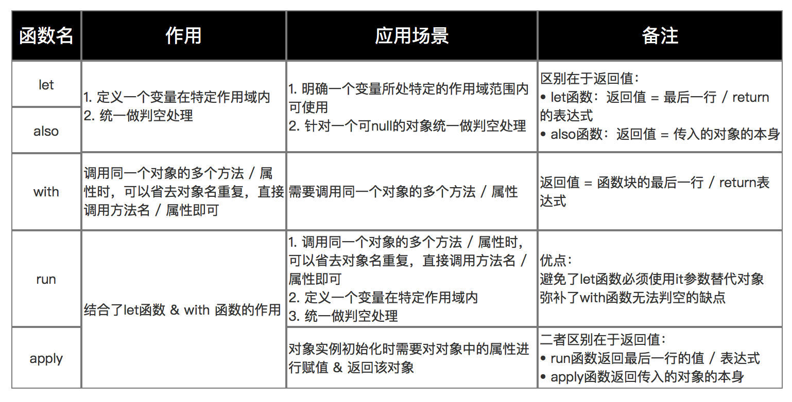

# Kotlin 入门

## 变量

**变量声明**

- `val`，赋值后不可改变变量的值，和Java中的final修饰的变量相似
- `var`，赋值后可以改变值

```kotlin
val count: Int = 10
count = 11 // 编译报错

var sum: Int = 20
sum = count + sum // sum的值变为30
```

- `const`，声明常量

`const`关键字用于修饰val类型的变量，表明该'变量'是一个常量。只能修饰顶层属性和类属性，且值必须在编译期就确定，类型只能是String和基本类型。

总结：

- `val`和`var`可以修饰顶层属性、类属性、局部变量
- `val`修饰类属性，可以生成`getter`方法，`var`修饰类属性可以生成`getter`和`setter`方法。
- 局部变量不会有`getter`和`setter`，`val`修饰局部变量相当于Java中的final
- `const`只能修饰顶层属性和类属性，值必须在编译期确定，值的类型只能是String和final类型。

**类型推断**

声明变量时同时赋值，即使不显式声明变量的类型，编译器也可以推断出变量的类型。

```kotlin
val count = 10  // Int
val name = 'Tom' // String 

name.inc() // 编译报错，String没有inc()方法
```

**空安全**

Kotlin中，默认类型是非空的，给非空类型变量赋值会编译错误。如果期望变量时可空的，需要在类型后加上`?`

```
val name: String = null // 编译报错

val name: String? = null
```

## 常见操作符

与Java中不一样的操作符

- `?` 表明类型是可空的，如 `val name: String? = null`
- `?:` Elvis操作符，表明左值为空时，取右值，如 `val firstName = name?:'unknown'`，firstName的值是unknown
- `?.` 安全调用，左值为空时，值也返回空，如 `val length = name?.length`，length的值也为null
- `!!` 断言一个表达式非空，如果为空会抛异常
- `==` 与 `!=` 值相等比较，等同于Java中的equals
- `===` 与 `!==` 引用比较，比较的是内存地址，等同于Java中的==
- `$` 字符串模板中引用变量或表达式
- `_` 在lambda或解构中代替未使用的参数

**类型判断**

`is`和`!is`可以用来做类型判断，相当于Java中的instanceof，用is判断了类型之后，在代码块中可以自动调用对应类型的方法，例如：

```kotlin
if (obj is String) {
    print(obj.length)
}

if (obj !is String) { // 与 !(obj is String) 相同
    print("Not a String")
} else {
    print(obj.length) // 智能转换
}
```

**类型转换**

`as`可以用来做类型转换，相当于Java中的强制类型转换。不安全的转换会在编译期报错。

```kotlin
val x: String = y as String
```

`as?`可以做安全的类型转换，当转换失败是返回null。

```kotlin
val x: String? = y as? String
```

## 条件语句

**if-else**

常规用法和Java一样，但是可以Kotlin中的if-else可以用来当条件表达式，例如：

```kotlin
val String message = if (code == 400) {
  "client error"
} else if (code == 500) {
  "server error"
} else {
  "known error
}
```

Kotlin中没有Java中的三目运算符 ?:，类似的用法都可以用三元表达式来实现。

**when**

当条件较多时，也可以用`when`关键字来做条件判断，示例：

```kotlin
var message: String

when {
  code == 400 -> "client error"
  code == 500 -> "server errro"
  else -> "known error"
}
```

## 函数

简单的函数声明可以省略{}，例如：

```kotlin
fun sum(n : Int, m : Int) = n + m // 省略了花括号和返回值，因为可以根据类型推断出返回类型
```

### 匿名函数

匿名函数没有函数名，可以将其赋值给变量，变量的类型为 `(参数类型, 参数类型) -> 返回值类型`，调用的时候加上括号，例如：

```java 
// 声明匿名函数
val multi: (Double, Double) -> Double = { x, y ->
    x + y
}

// 使用匿名函数
multi(2.0, 3.0)
val mm = multi
mm(2.0, 3.0)
```

### 高阶函数

高阶函数指的是函数的参数也是函数，例如：

```java
fun advancedFunc(m: Int, mapper: (Int) -> String) : String{
    return mapper(m)
}

advancedFunc(10, { num -> "$num"})
```

高阶函数的最后一个参数如果是匿名函数，可以把这个匿名函数放在调用的圆括号外面，gradle的kotlin DSL中有很多这种用法。例如上面的调用可以写成：

```
advancedFunc(10) { num ->
  "$num"
}
```

高阶函数会有一些运行时上的开销，因为函数是一个对象，在函数的实现中，会访问局部变量，因此在内存占用和虚拟调用都会有一定的开销。

### 内联函数

内联函数通过inline关键字修饰，会将调用函数的地方内联成函数的实现。内联函数会引入额外的代码，不过使用得当也能提升性能。

```kotlin
inline fun inlineFun(m: Int, mapper: (Int) -> String) : String {
    return mapper.invoke(m)
}
```

如果不希望传给函数的参数被内联，也可以用noinline参数修复函数参数。noinline关键字不能修饰函数，可以修饰函数参数。

```kotlin
inline fun inlineParams(m: Int, mapper: (Int) -> String, noinline reducer: (Int) -> Int): String {
    return mapper.invoke(reducer.invoke(m))
}
```

### Kotlin内置的函数

**let**

let是一个作用域函数，在一个作用域内，对对象统一进行操作而不用重复判空。返回值由作用域内最后一行表达式或者return语句决定。

```kotlin
val american: American? = if (System.nanoTime() % 10 > 5) American() else null
val nation = american?.let {
  it.sayHello()
  it.showGift()
  // 返回值
  it.nation // 也可以写成 return it.nation
}
print(nation)
```

**also**

also的作用和let一样，区别是also返回的是传入作用域的对象。

```kotlin
// also
val chinese = Chinese()
val person = chinese.also {
  it.sayHello()
  // 返回person本身，而不是nation
  it.nation
}
print(person.nation)
```

**with**

with的使用方法和let类似，返回值是最行一行表达式或者return语句。它有2个参数，第二个参数是匿名函数。使用时用`with(obj){...}`
在作用域内使用时可以省略对象名，直接调用对象的方法或属性。

```kotlin
val age = with(chinese) {
  sayHello()
  print("I come from $nation")
  showGift()
  val age = 20
  // 返回age
  age
}
println("with: age $age")

```

**run**

run相当于是let和with的结合体，返回值也是**最后一行表达式**或**return语句**，使用时直接用`obj.run{...}`，作用域内可以省略对象名，直接调用方法或属性

```kotlin
    val ret = chinese.run {
        sayHello()
        showGift()
        // 返回bye
        "bye"
    }
    println("run: $ret")
```

**apply**

apply相当于是also和with的结合体，返回值是**对象本身**。使用时直接用`obj.run{...}`，作用域内可以省略对象名，直接调用方法或属性

```kotlin
    val person2 = chinese.apply {
        sayHello()
        showGift()
        sayGoodbye()
        // 返回chinese对象本身
    }
    println("apply: ${person2.javaClass}") // com.kotlin.classes.Chinese
```



## 类

### 类的构造

Kotlin中类实例化不需要使用new关键字。

**构造函数**

类有一个主构造函数，和多个次构造函数。当主构造函数没有修饰符时，可以省略constructor关键字。

```kotlin
// 主构造函数
class Person constructor(firstName: String) { /*……*/ }

// 可省略constructor参数
class Person(firstName: String) { /*……*/ }

// 次级构造函数
class Person(val name: String) {
    val children: MutableList<Person> = mutableListOf()
    constructor(name: String, parent: Person) : this(name) {
        parent.children.add(this)
    }
}

```

### 可见性

Kotlin中类默认都是不可继承的(抽象类除外)，如需继承，需要加`open`关键字。

### 特殊的类

**密封类**

密封类通过`sealed`关键字修饰，所有直接继承自密封类的子类都必须在编译期确定。1.5之前，密封类只能定义在同一个文件中，1.5之后放宽了限制，密封类的子类可以定义在相同包的任意文件中，但是超出对应包之后，还是会编译失败。1.5中还引入了密封接口，用法类似。

```kotlin
// SealedClass.kt
package com.kotlin.classes

sealed class Expr

data class Const(val number: Double) : Expr()

object NotNumber: Expr()

// SealedClassOtherFile.kt -- 同一个包下的其他文件也可以定义密封类的子类
package com.kotlin.classes

class Empty(string: String): Expr()

// SealedClassOtherModule.kt -- 其他包中类不可以直接继承密封类
package com.kotlin.class2

import com.kotlin.classes.Expr

package com.kotlin.class2

// 编译失败，因为Expr在另一个包中
class Empty(string: String): Expr()
```

Java 15中新增了一个新的关键字sealed，和kotlin中的密封类用法一样

密封类的使用场景：

- 只想要有限的继承：想要在编译期知道全部的类型。
- 对类型安全有诉求：状态管理、复杂逻辑处理等场景，可以用when表达式，枚举出所有的场景，保重不出现意料之外的类型。
- 封闭API：例如开发SDK时，只期望对外暴露有限的接口

**数据类**

数据类型通过`data`关键字修饰，编译器会自动生成`equals()`、`hashCode()`、`toString()`、`copy()`等方法。


**嵌套类**

**枚举类**

**内联类**

### 伴生对象

### 委托


*参考*

1. [学习 Kotlin 编程语言](https://developer.android.google.cn/kotlin/learn?hl=zh-cn)
2. [关键字与操作符](https://book.kotlincn.net/text/keyword-reference.html)
3. [巧用Kotlin：内置函数let、also、with、run、apply大大提高你的开发效率！](https://cloud.tencent.com/developer/article/1591238)